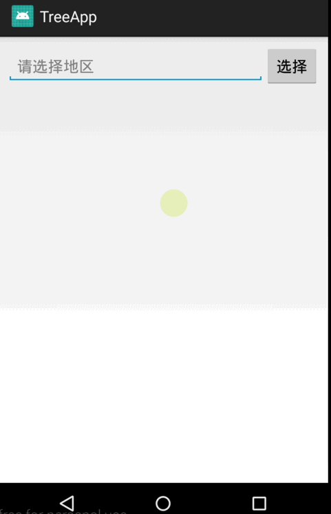

# TreeApp
this library support a unlimited tree structure，but there are some requirements for data structure!

# 效果展示

# 控件使用示例
1. 引入依赖

    在项目工程的build.gradle添加如下代码：

        allprojects {
            repositories {
                ...  //other repository
                maven { url 'https://jitpack.io' }
            }
        }
    }

    在需要使用本控件的module的build.gradle添加如下代码：

        dependencies {
    	            compile 'com.github.yuanchaowhut:TreeApp:v1.0'
    	}

2. 关于数据结构
   + 本项目对数据结构有严格要求，举例说明如下： 

         //eg1：id , pid , label

           mDatas.add(new FileBean(1, 0, "文件管理系统"));
           mDatas.add(new FileBean(2, 1, "游戏"));
           mDatas.add(new FileBean(3, 1, "文档"));
           mDatas.add(new FileBean(4, 1, "程序"));
           mDatas.add(new FileBean(5, 2, "war3"));
           mDatas.add(new FileBean(6, 2, "刀塔传奇"));

           mDatas.add(new FileBean(7, 4, "面向对象"));
           mDatas.add(new FileBean(8, 4, "非面向对象"));

           mDatas.add(new FileBean(9, 7, "C++"));
           mDatas.add(new FileBean(10, 7, "JAVA"));
           mDatas.add(new FileBean(11, 7, "Javascript"));
           mDatas.add(new FileBean(12, 8, "C"));

         //eg2：id , pid , name , 其他属性
         //省
         List<RegionBean> dataList = new ArrayList<>();
         RegionBean bean1 = new RegionBean(1, 0, "湖北省", "省级");
         RegionBean bean2 = new RegionBean(2, 0, "广东省", "省级");
         RegionBean bean3 = new RegionBean(3, 0, "浙江省", "省级");
         //市
         RegionBean bean4 = new RegionBean(4, 1, "武汉市", "市级");
         RegionBean bean5 = new RegionBean(5, 1, "宜昌市", "市级");
         RegionBean bean6 = new RegionBean(6, 1, "黄冈市", "市级");

         RegionBean bean7 = new RegionBean(7, 2, "广州市", "市级");
         RegionBean bean8 = new RegionBean(8, 2, "深圳市", "市级");
         RegionBean bean9 = new RegionBean(9, 2, "佛山市", "市级");

         RegionBean bean10 = new RegionBean(10, 3, "杭州市", "市级");
         RegionBean bean11 = new RegionBean(11, 3, "台州市", "市级");
         RegionBean bean12 = new RegionBean(12, 3, "温州市", "市级");
         //县区
         RegionBean bean13 = new RegionBean(13, 4, "武昌区", "区县级");
         RegionBean bean14 = new RegionBean(14, 4, "汉口区", "区县级");
         RegionBean bean15 = new RegionBean(15, 4, "汉阳区", "区县级");

         RegionBean bean16 = new RegionBean(16, 5, "夷陵区", "区县级");
         RegionBean bean17 = new RegionBean(17, 5, "东陵区", "区县级");
         RegionBean bean18 = new RegionBean(18, 5, "猇亭区", "区县级");
   通过上面2个举例，可以看到各个条目(不论父子节点）从表面上看是平级的，都是封装成一个简单的对象，但是它们内在却是有联系的，
   是通过id,pid进行父子层级划分。这种数据结构是典型的树形结构，常用于数据库字典表中，是一种比较简单的结构。
  + 创建实体类时，我们并不需要严格按照id,pig,label去给字段命名，但是必须在相应的字段上添加上对应的注解(TreeNodeId、TreeNodePid、TreeNodeLabel)，
    否则无法显示树状图，因为代码内部逻辑就是依据字段上的注解，而不是字段名。

        public class RegionBean implements Serializable{
            private static final long serialVersionUID = 1142354686070936L;
            @TreeNodeId
            private int id;
            @TreeNodePid
            private int pid;
            @TreeNodeLabel
            private String name;
            //省级、市级、县区级、乡镇级
            private String type;
        ................................

3. 新建一个Activity继承自BaseTreeActivity重写对应的抽象方法

       public class RegionTreeActivity extends BaseTreeActivity<RegionBean> {

           @Override
           protected void onCreate(Bundle savedInstanceState) {
               super.onCreate(savedInstanceState);
           }

           @Override
           protected List<RegionBean> getDataList() {
               return Mock.getData();
           }

           @Override
           protected ICallBack<Node> getClickCallBack() {
               return new ICallBack<Node>() {
                   @Override
                   public void onResult(int obj, Node resultObj) {
                       Intent intent = new Intent(RegionTreeActivity.this, MainActivity.class);
                       //注意:如果自定义的实体类RegionBean不愿意实现Serializable接口，则此处这些数据需要挨个putExtra进行传递.
                       //建议如非特殊情况，实现Serializable接口比较方便，直接传递对象即可。
           //                intent.putExtra(TreeConst.KEY_NODE_ID,resultObj.getId());
           //                intent.putExtra(TreeConst.KEY_NODE_ID,resultObj.getName());
           //                RegionBean regionBean = (RegionBean) resultObj.getT();
           //                intent.putExtra(TreeConst.KEY_REGION_TYPE,regionBean.getType());

                       intent.putExtra(TreeConst.KEY_NODE, resultObj);
                       if (obj == ICallBack.TYPE_CLICK) {                   //单击
                           if (resultObj.isLeaf()) {
                               setResult(TreeConst.RESULT_CODE_CLICK, intent);
                               finish();
                           }
                       } else if (obj == ICallBack.TYPE_LONG_CLICK) {       //长按
                           if (!resultObj.isLeaf()) {
                               setResult(TreeConst.RESULT_CODE_LONG_CLICK, intent);
                               finish();
                           }
                       }

                   }
               };
           }

           @Override
           protected boolean isNeedThread() {
               return true;
           }
       }

    这里分别对几个方法做个简单的说明： 

    | 方法   | 是否抽象  |  作用  |
    | :----:| :-----:  | :----: |
    | isNeedThread()   |否      |决定是否需要开启线程，默认为false(表不开启)，联网获取数据的场景必须开启线程|
    | getDataList()   |是      |获取树形结构数据的方法，如果isNeedThread()返回true，则本方法在子线程执行|
    | getClickCallBack() |是      |用于实际处理每个item的点击事件，建议参考本app中的使用方法|

4. 总结回顾
   + 本项目是在鸿洋大神的[Android 打造任意层级树形控件](https://blog.csdn.net/lmj623565791/article/details/40212367)基础上做了一些扩展和封装，
     使得使用起来更加方便，这里我并不打算详细介绍代码逻辑及实现方法，因为鸿洋大神在他的博客里已经写的非常详细了，感兴趣者可以自行查看。
   + 从整个使用流程来看，实际上开发人员只需要做2件事即可，一是按要求创建一个实体对象，二是写一个Activity继承BaseTreeActivity，并复写几个方法。
     相对来说，使用起来还是很方便的，这是因为大量的工作已经在BaseTreeActivity里完成了。
   + 本例提供了一个SimpleTreeAdapter适配器，继承自TreeListViewAdapter<T>，其中有一个getConvertView()是重写的父类方法，如果布局不能满足
     实际需求，那么你可以自己写一个XXXAdapter去继承TreeListViewAdapter<T>，然后进行各种布局。
   + 自己创建的实体类是否实现Serializable接口，取决于你是否想在Activity中整体传递Node对象或者该实体对象，一般建议实现该接口，如果不实现，则在需要
     传递数据的地方先从对象身上取数据，然后使用诸如：putExtra之类的方法挨个进行存储。当然这在对象字段比较多的情况下是很不利的！

# 缺陷及不足
+ 本项目对数据结构要求非常严格，要求父子节点必须通过id,pid进行关联，实际开发中可能后台接口返回的并非此种格式，因此需要后端人员配合；
+ 本项目id、pid要求为int类型，但是实际开发中，可能出现非int类型的情况，比如行政区划，通过一个行String类型的编码进行关联，这种情况
  处理起来其实也很简单，因为它只影响到了节点的父子关系明确上。首先你需要做的是clone下我的项目，然后自行改造，将Node对象的id,pid修改为String类型，
  然后找到TreeHelp.java中的convertData2Node()方法，找到对应的代码片段：

      /**
        * 设置Node间，父子关系;让每两个节点都比较一次，即可设置其中的关系
        */
          for (int i = 0; i < nodes.size(); i++) {
              Node n = nodes.get(i);
              for (int j = i + 1; j < nodes.size(); j++) {
                  Node m = nodes.get(j);
                  if (m.getpId() == n.getId()) {
                      n.getChildren().add(m);
                      m.setParent(n);
                  } else if (m.getId() == n.getpId()) {
                      m.getChildren().add(n);
                      n.setParent(m);
                  }
              }
          }
  将 if(m.getpId() == n.getId()) 这样的判断语句变为 if(m.getpId().equals(n.getId())) 这样的即可 ，然后修复改变字段类型带来的错误。

+ 最后，由于个人水平有限，如果使用过程中出现bug，欢迎大家踊跃提出修改建议，交流QQ：928898858